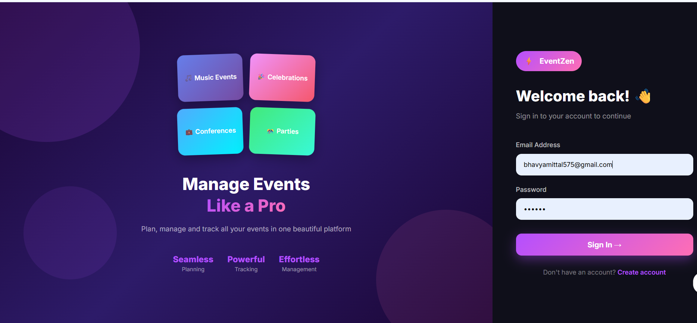
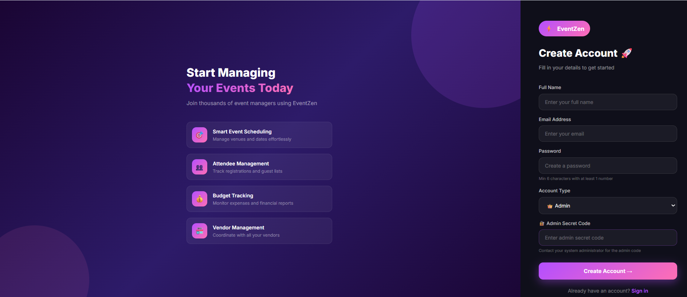
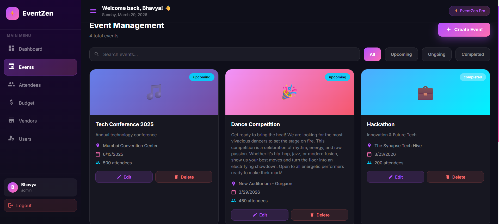
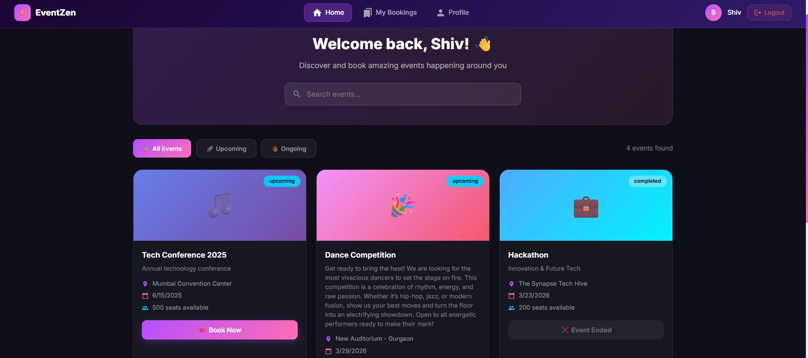

# ✨ Features – EventZen

> Complete feature list for all modules of the EventZen Event Management System

---

## Application Overview

EventZen is a **full-stack event management platform** with role-based access control, built using a microservices architecture. It serves two types of users — **Admins** (event managers) and **Customers** (event attendees).

---

## 🔐 Module 1: User Authentication

### Features
- **User Registration** — Create account with name, email, password and role selection
- **Role Selection** — Register as Admin (with secret code) or Regular User
- **Admin Protection** — Secret code `EVENTZEN@ADMIN2025` required for admin accounts
- **Secure Login** — JWT-based authentication with 24-hour token expiry
- **Password Hashing** — Bcrypt encryption with 10 salt rounds
- **Password Validation** — Minimum 6 characters, at least 1 number enforced
- **JWT Middleware** — All protected routes verify token on every request
- **Role-Based Redirect** — Admin → Dashboard, User → Customer Portal
- **Auto Logout** — Token cleared on logout, redirected to login
- **User Management** — Admin can view all registered users with roles

### Tech Used
- Node.js, Express.js, MySQL, JWT, Bcrypt

### 🔐 Login Page
<p align="center">
  
</p>

### 📝 Register Page
<p align="center">
  
</p>

---

## 🎯 Module 2: Event Management

### Features
- **Create Events** — Add title, description, date, venue, capacity, status
- **View Events** — Beautiful card-based grid with event banners and emojis
- **Edit Events** — Pre-populated modal form for quick updates
- **Delete Events** — Confirmation dialog before permanent deletion
- **Search Events** — Real-time search by title or venue
- **Filter Events** — Filter by All / Upcoming / Ongoing / Completed status
- **Status Badges** — Color-coded status indicators on each card
- **Event Counter** — Total events count shown in header
- **Animated Cards** — Hover animations with card lift effect

### Tech Used
- Node.js, Express.js, MongoDB, Mongoose

### 🎉 Event Page(Admin)
<p align="center">
  
</p>

### 🎉 Event Page(Customer)
<p align="center">
  
</p>

---

## 👥 Module 3: Attendee Management

### Features
- **Event Selection** — Dropdown to select which event to manage attendees for
- **Event Info Banner** — Shows selected event details, registered count, capacity and fill %
- **Register Attendees** — Add attendee name and email via modal form
- **View Attendees** — Card grid showing all registered attendees
- **Duplicate Prevention** — System prevents same user from booking twice
- **Remove Attendees** — Delete attendee with confirmation
- **Search Attendees** — Filter attendees by name or email
- **Capacity Tracking** — Visual percentage of how full the event is
- **Customer Booking** — Users can self-register from Customer Portal

### Tech Used
- .NET 8, ASP.NET Core Web API, MongoDB

---

## 💰 Module 4: Budget Tracking

### Features
- **Set Total Budget** — Define maximum budget for each event
- **Add Expenses** — Log expenses with name, amount, and category
- **6 Expense Categories** — Venue, Catering, Decoration, Marketing, Technology, Other
- **Real-time Calculation** — Remaining budget auto-calculated as expenses are added
- **Visual Progress Bar** — Animated bar showing percentage of budget used
- **Color Warning** — Bar turns red when budget usage exceeds 80%
- **Summary Cards** — Total Budget, Total Expenses, Remaining shown prominently
- **Expense Breakdown** — Categorized list with colored badges
- **Category Icons** — Each category has a unique emoji indicator

### Tech Used
- Spring Boot 3.x, Java 21, MongoDB, Spring Data

---

## 🏪 Module 5: Vendor Management

### Features
- **Add Vendors** — Register vendors with full contact details
- **8 Categories** — Catering, Photography, Decoration, Music, Security, Transport, Technology, Other
- **Event Assignment** — Link vendors to specific events
- **Status Tracking** — Mark vendors as Active or Inactive
- **Price Tracking** — Record service pricing for budget planning
- **Notes Field** — Add special requirements or notes
- **Search Vendors** — Filter by vendor name
- **Category Filter** — Show vendors by specific category
- **Stats Dashboard** — Total vendors, active count, total vendor value
- **Edit & Delete** — Full CRUD operations with confirmation

### Tech Used
- Node.js, Express.js, MongoDB, Mongoose

---

## 👑 Admin Portal Features

- **Sidebar Navigation** — Collapsible sidebar with all module links
- **Active Route Highlight** — Current page highlighted in sidebar
- **Top Bar** — Welcome message with current date
- **Pro Badge** — "EventZen Pro" badge in top bar
- **User Avatar** — Initials-based avatar with name and role
- **Dashboard Charts** — Bar chart (capacity) + Pie chart (status)
- **Stats Cards** — 4 animated stat cards with hover effects
- **Recent Events Table** — Last 5 events with status badges
- **Responsive Design** — Works on different screen sizes

---

## 👤 Customer Portal Features

- **Top Navbar** — Horizontal navigation with Home, Bookings, Profile links
- **Hero Section** — Welcome banner with search bar
- **Event Cards** — Browse events with Book Now button
- **One-Click Booking** — Register for events instantly
- **Duplicate Check** — Prevents double booking of same event
- **My Bookings** — View all events registered for with confirmation status
- **Profile Page** — Account details with gradient avatar
- **Success Messages** — Animated confirmation on successful booking

---

## 🎨 UI/UX Features

- **Dark Theme** — Professional dark purple/pink gradient design
- **Framer Motion** — Smooth page transitions and card animations
- **Hover Effects** — Cards lift on hover for interactive feel
- **Color Theory** — 70-30-10 rule applied (Purple 70%, Pink 30%, Accent 10%)
- **Responsive Layout** — Works on desktop and tablet
- **Custom Scrollbar** — Purple gradient scrollbar styling
- **Loading States** — Loading indicators for async operations
- **Error Messages** — Clear error feedback for all operations
- **Success Messages** — Green confirmation messages
- **Form Validation** — Client-side validation before API calls

---

## 🐳 DevOps Features

- **7 Docker Containers** — Each service fully containerized
- **docker-compose** — Single command to start entire application
```
docker-compose up --build
```

- **Health Checks** — MySQL and MongoDB health monitoring
- **Network Isolation** — Services communicate via Docker network
- **Volume Persistence** — Data persists between container restarts
- **Environment Variables** — All config via environment variables
- **.dockerignore** — node_modules excluded from builds

---

*EventZen Features | Bhavya Mittal | Deloitte Training 2025-26*