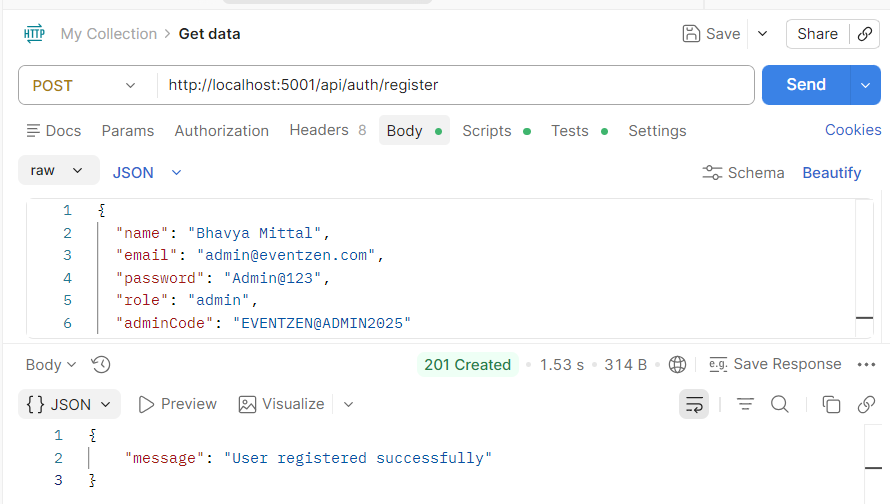
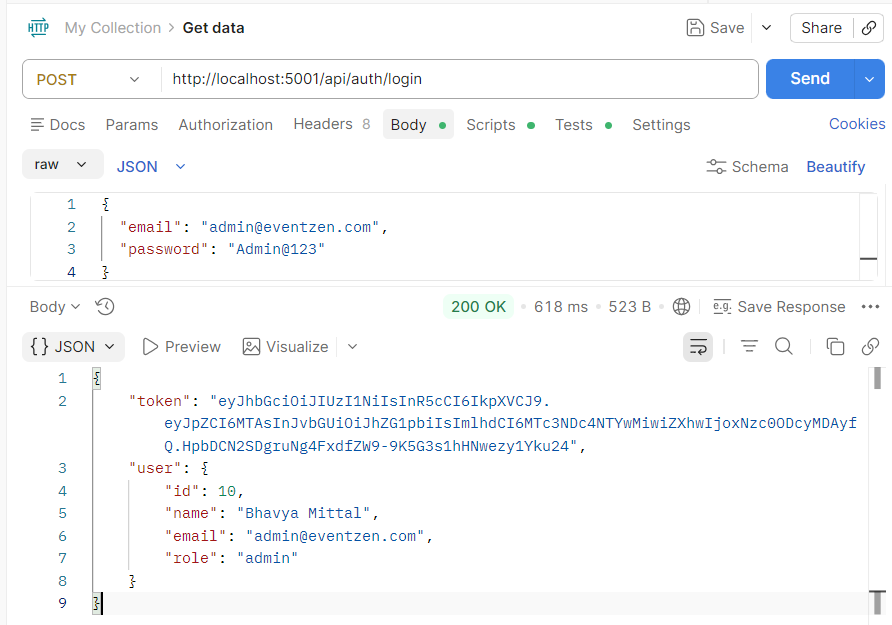
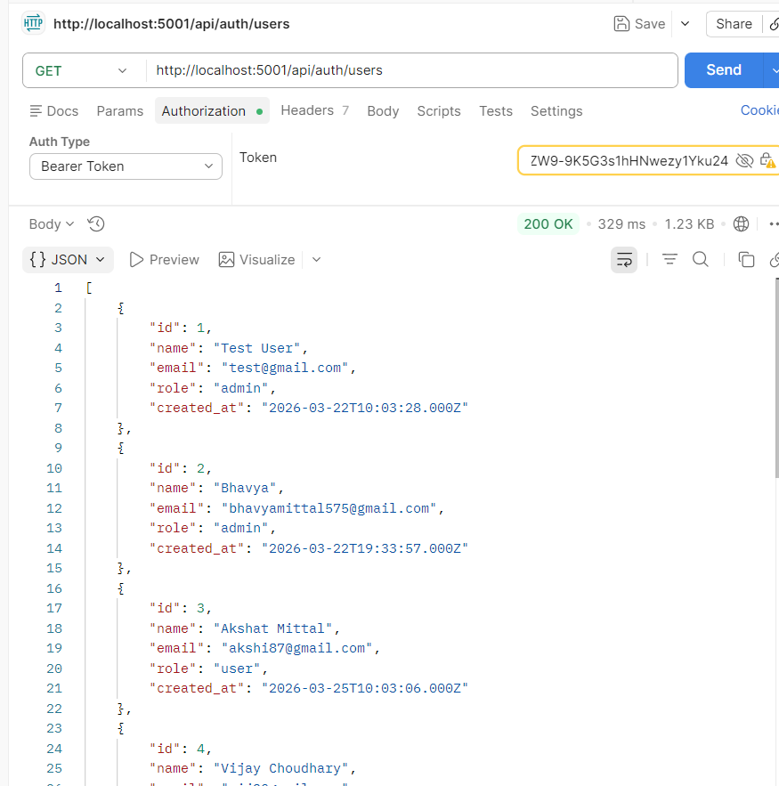
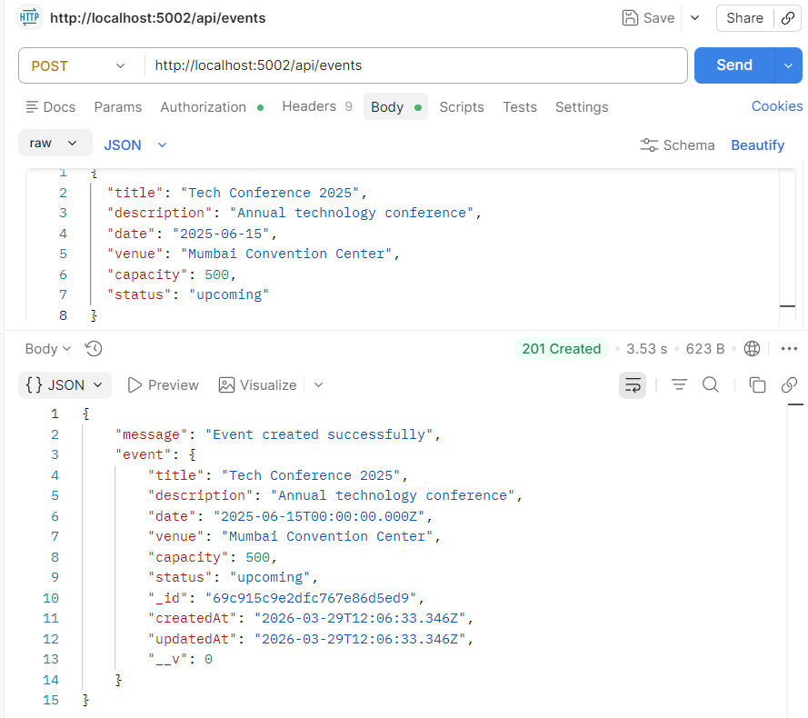
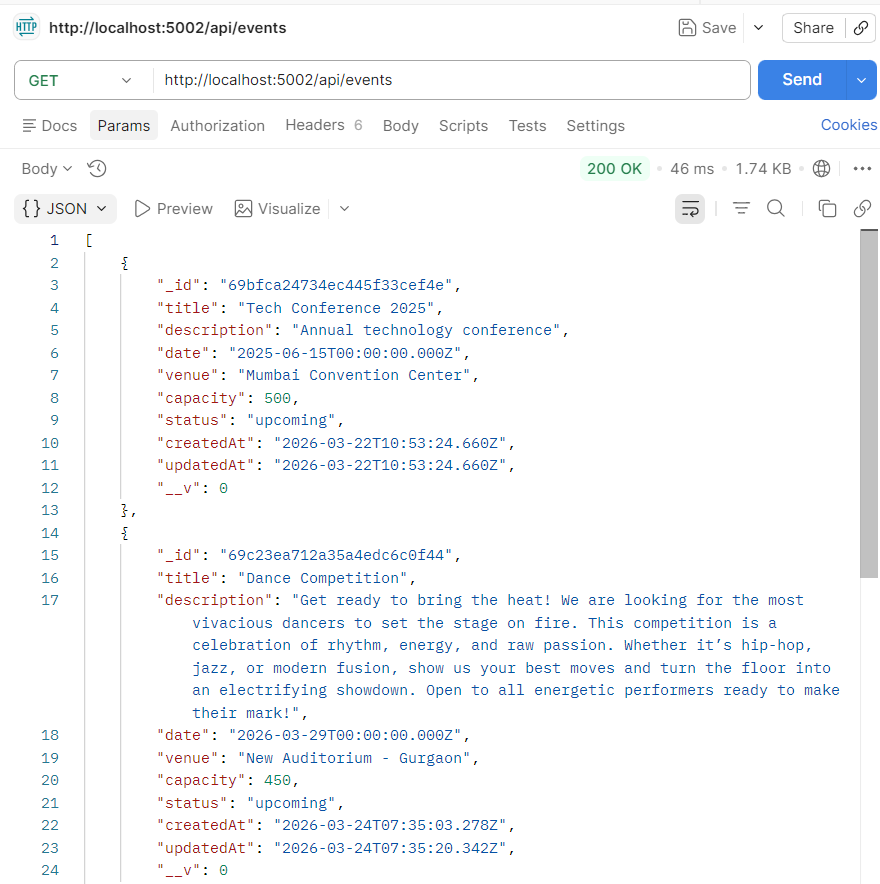
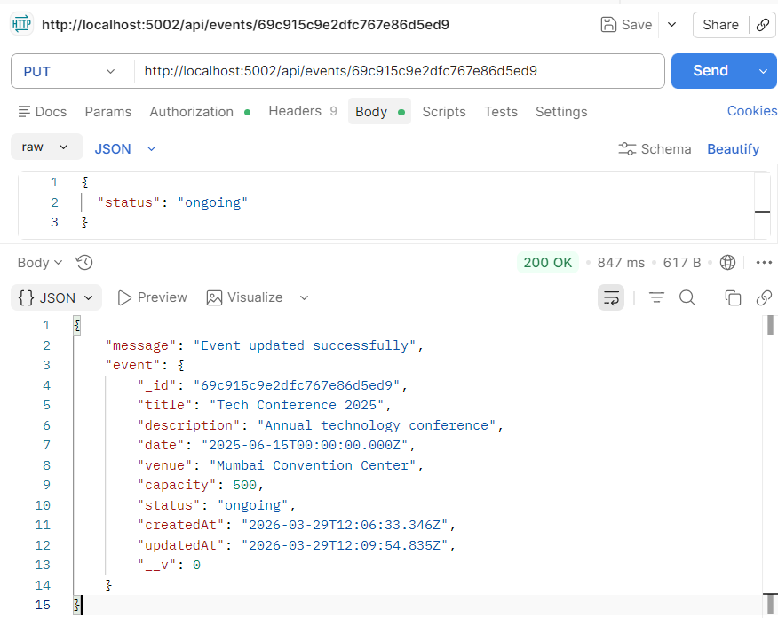
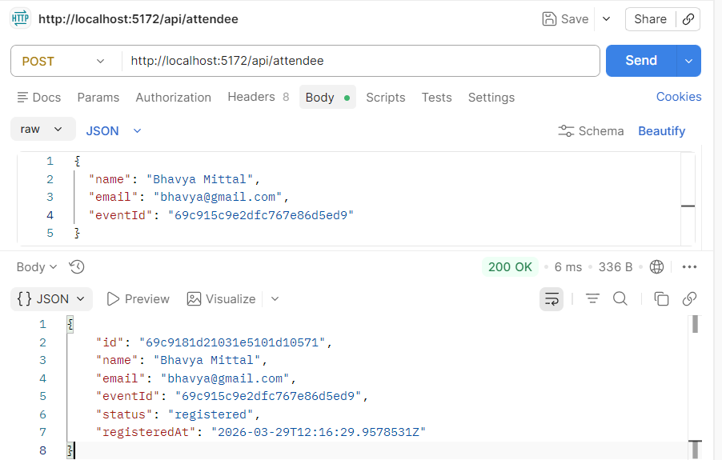
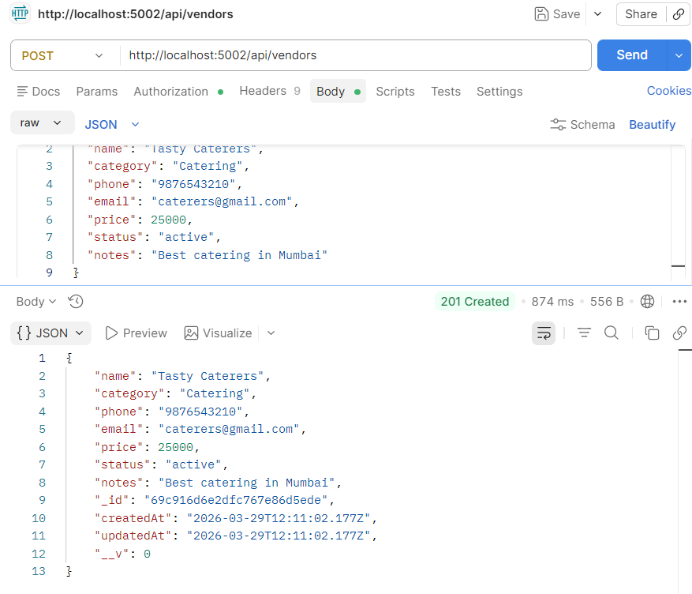
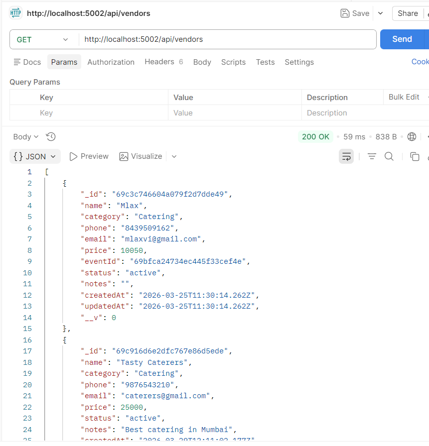
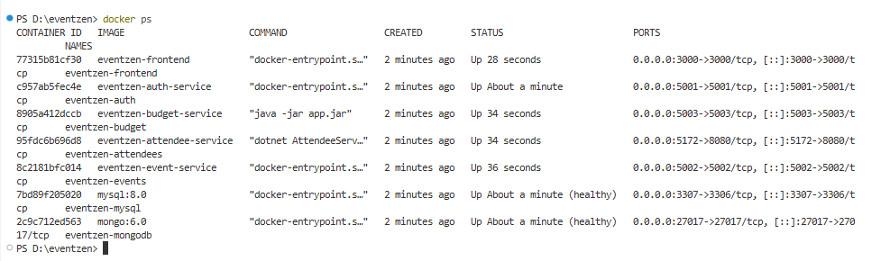

# 🧪 Testing Documentation – EventZen

> API Testing, Frontend Testing, and Validation Evidence

---

## Testing Approach

EventZen was tested using:
1. **Postman** – API endpoint testing
2. **Manual UI Testing** – Frontend flow validation
3. **Browser Console** – Error monitoring

---

## 📮 Postman API Testing

---

### Test Case 1: User Registration

**Request:**
```
POST http://localhost:5001/api/auth/register
Body: {
  "name": "Bhavya Mittal",
  "email": "admin@test.com",
  "password": "Admin123",
  "role": "admin",
  "adminCode": "EVENTZEN@ADMIN2025"
}
```

| Test | Expected | Result |
|------|----------|--------|
| Valid registration | 201 Created | ✅ Pass |
| Duplicate email | 400 "Email already exists" | ✅ Pass |
| Wrong admin code | 403 "Invalid admin code!" | ✅ Pass |
| Missing fields | 400 Error | ✅ Pass |

<p align="center">
  
</p>

---

### Test Case 2: User Login

**Request:**
```
POST http://localhost:5001/api/auth/login
Body: {
  "email": "admin@test.com",
  "password": "Admin123"
}
```

| Test | Expected | Result |
|------|----------|--------|
| Valid credentials | 200 + JWT token | ✅ Pass |
| Wrong password | 400 "Wrong password" | ✅ Pass |
| Non-existent email | 400 "User not found" | ✅ Pass |
<p align="center">
  
</p>


---

### Test Case 3: Get All Users (Protected)

**Request:**
```
GET http://localhost:5001/api/auth/users
Headers: Authorization: Bearer <token>
```

| Test | Expected | Result |
|------|----------|--------|
| With valid JWT | 200 + user array | ✅ Pass |
| Without JWT | 401 "No token provided" | ✅ Pass |
| Expired/invalid JWT | 401 "Invalid token" | ✅ Pass |

<p align="center">
  
</p>


---

### Test Case 4: Create Event

**Request:**
```
POST http://localhost:5002/api/events
Headers: Authorization: Bearer <token>
Body: {
  "title": "Tech Conference 2025",
  "description": "Annual technology Conference",
  "date": "2025-06-15",
  "venue": "Mumbai Convention Center",
  "capacity": 500,
  "status": "upcoming"
}
```

| Test | Expected | Result |
|------|----------|--------|
| Valid event data | 201 Created with _id | ✅ Pass |
| Missing required field | 500 Error | ✅ Pass |

<p align="center">
  
</p>


---

### Test Case 5: Get All Events

**Request:**
```
GET http://localhost:5002/api/events
```

| Test | Expected | Result |
|------|----------|--------|
| Events exist | 200 + array of events | ✅ Pass |
| Empty database | 200 + empty array [] | ✅ Pass |

<p align="center">
  
</p>


---

### Test Case 6: Update Event

**Request:**
```
PUT http://localhost:5002/api/events/<event_id>
Headers: Authorization: Bearer <token>
Body: {
  "status": "ongoing"
}
```

| Test | Expected | Result |
|------|----------|--------|
| Valid update | 200 + updated event | ✅ Pass |
| Invalid ID format | 500 Error | ✅ Pass |

<p align="center">
  
</p>


---

### Test Case 7: Register Attendee

**Request:**
```
POST http://localhost:5172/api/attendee
Body: {
  "name": "Bhavya Mittal",
  "email": "bhavya@gmail.com",
  "eventId": "<event_id_from_step_4>"
}
```

| Test | Expected | Result |
|------|----------|--------|
| Valid registration | 200 + attendee object | ✅ Pass |
| Missing eventId | 400 Error | ✅ Pass |

<p align="center">
  
</p>


---

### Test Case 8: Create Vendor

**Request:**
```
POST http://localhost:5002/api/vendors
Body: {
  "name": "Tasty Caterers",
  "category": "Catering",
  "phone": "9876543210",
  "email": "caterers@gmail.com",
  "price": 25000,
  "status": "active",
  "notes": "Best catering in Mumbai"
}
```

| Test | Expected | Result |
|------|----------|--------|
| Valid budget | 200 + budget object | ✅ Pass |

<p align="center">
  
</p>

---

### Test Case 9: Get All Vendors

**Request:**
```
GET http://localhost:5002/api/vendorse

```

| Test | Expected | Result |
|------|----------|--------|
| Valid expense | 200 + updated budget | ✅ Pass |
| Non-existent event | 500 Error | ✅ Pass |

<p align="center">
  
</p>

---

## 🖥️ Frontend UI Testing

### Registration Validation Tests

| Test Case | Action | Expected | Result |
|-----------|--------|----------|--------|
| Short password | Enter "123" | "Password must be at least 6 characters!" | ✅ |
| No number in password | Enter "abcdef" | "Password must contain at least 1 number!" | ✅ |
| Wrong admin code | Enter "wrong123" | "Invalid admin code!" from server | ✅ |
| Duplicate email | Register twice | "Email already exists" | ✅ |
| Empty name field | Submit blank | Browser validation prevents submit | ✅ |

### Login Flow Tests

| Test Case | Action | Expected | Result |
|-----------|--------|----------|--------|
| Admin login | Login as admin | Redirect to `/` dashboard | ✅ |
| User login | Login as user | Redirect to `/user` portal | ✅ |
| Wrong password | Enter wrong pass | "Invalid email or password!" error | ✅ |
| No token, visit `/` | Clear storage | Redirect to `/login` | ✅ |

### Event CRUD Tests

| Test Case | Action | Expected | Result |
|-----------|--------|----------|--------|
| Create event | Fill form, submit | New card in grid | ✅ |
| Edit event | Click edit, modify, save | Card updated | ✅ |
| Delete event | Click delete, confirm | Card removed | ✅ |
| Search events | Type in search bar | Real-time filter | ✅ |
| Filter by status | Click filter tab | Shows correct events | ✅ |

### Booking Tests

| Test Case | Action | Expected | Result |
|-----------|--------|----------|--------|
| Book event | Click "Book Now" | Success message shown | ✅ |
| Book same event again | Click "Book Now" again | "Already registered!" alert | ✅ |
| Book completed event | Button disabled | "Event Ended" shown | ✅ |
| View bookings | Go to /user/bookings | All booked events listed | ✅ |

---


## 🐳 Docker Verification

```bash
docker ps
```

Output shows 7 containers:

<p align="center">
  
</p>

```

---

*EventZen Testing Documentation | Bhavya Mittal | Deloitte Training 2025-26*