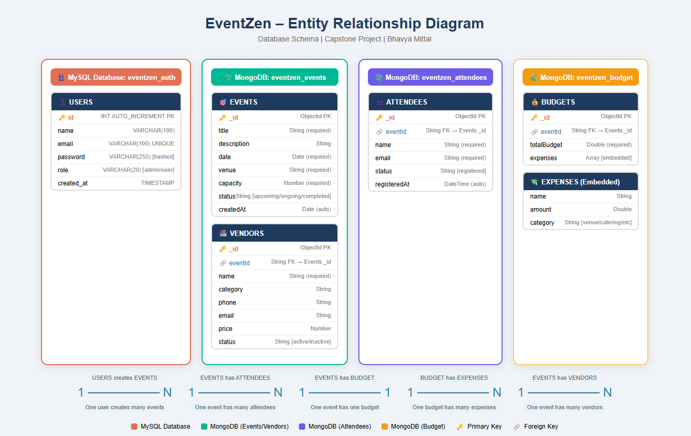

# 🗄️ ER Diagram – EventZen

> Entity Relationship Diagram for all databases used in EventZen

---

## Database Architecture Overview

EventZen uses a **polyglot persistence** strategy:
- **MySQL** → Structured relational data (Users)
- **MongoDB** → Flexible document data (Events, Vendors, Attendees, Budgets)

---

### 📄 ER Diagram
<p align="center">
  
</p>


## MySQL Database: `eventzen_auth`

### Table: `users`

```
┌─────────────────────────────────────────────┐
│                   USERS                      │
├──────────────┬──────────────┬────────────────┤
│ Column       │ Type         │ Constraints    │
├──────────────┼──────────────┼────────────────┤
│ id           │ INT          │ PK, AUTO_INC   │
│ name         │ VARCHAR(100) │ NOT NULL       │
│ email        │ VARCHAR(100) │ UNIQUE, NN     │
│ password     │ VARCHAR(255) │ NOT NULL       │
│ role         │ VARCHAR(20)  │ DEFAULT 'user' │
│ created_at   │ TIMESTAMP    │ DEFAULT NOW()  │
└──────────────┴──────────────┴────────────────┘
```

---

## MongoDB Database: `eventzen_events`

### Collection: `events`

```
┌─────────────────────────────────────────────┐
│                   EVENTS                     │
├──────────────┬──────────────┬────────────────┤
│ Field        │ Type         │ Notes          │
├──────────────┼──────────────┼────────────────┤
│ _id          │ ObjectId     │ PK (auto)      │
│ title        │ String       │ required       │
│ description  │ String       │ optional       │
│ date         │ Date         │ required       │
│ venue        │ String       │ required       │
│ capacity     │ Number       │ required       │
│ status       │ String       │ upcoming/...   │
│ createdBy    │ String       │ user reference │
│ createdAt    │ Date         │ auto           │
│ updatedAt    │ Date         │ auto           │
└──────────────┴──────────────┴────────────────┘
```

### Collection: `vendors`

```
┌─────────────────────────────────────────────┐
│                  VENDORS                     │
├──────────────┬──────────────┬────────────────┤
│ Field        │ Type         │ Notes          │
├──────────────┼──────────────┼────────────────┤
│ _id          │ ObjectId     │ PK (auto)      │
│ name         │ String       │ required       │
│ category     │ String       │ required       │
│ phone        │ String       │ optional       │
│ email        │ String       │ optional       │
│ price        │ Number       │ optional       │
│ eventId      │ String       │ FK → Events    │
│ status       │ String       │ active/inactive│
│ notes        │ String       │ optional       │
│ createdAt    │ Date         │ auto           │
└──────────────┴──────────────┴────────────────┘
```

---

## MongoDB Database: `eventzen_attendees`

### Collection: `attendees`

```
┌─────────────────────────────────────────────┐
│                 ATTENDEES                    │
├──────────────┬──────────────┬────────────────┤
│ Field        │ Type         │ Notes          │
├──────────────┼──────────────┼────────────────┤
│ _id (Id)     │ ObjectId     │ PK (auto)      │
│ name         │ String       │ required       │
│ email        │ String       │ required       │
│ eventId      │ String       │ FK → Events    │
│ status       │ String       │ registered     │
│ registeredAt │ DateTime     │ auto (UTC)     │
└──────────────┴──────────────┴────────────────┘
```

---

## MongoDB Database: `eventzen_budget`

### Collection: `budgets`

```
┌─────────────────────────────────────────────┐
│                  BUDGETS                     │
├──────────────┬──────────────┬────────────────┤
│ Field        │ Type         │ Notes          │
├──────────────┼──────────────┼────────────────┤
│ _id          │ ObjectId     │ PK (auto)      │
│ eventId      │ String       │ FK → Events    │
│ totalBudget  │ Double       │ required       │
│ expenses     │ Array        │ embedded docs  │
└──────────────┴──────────────┴────────────────┘

  Embedded: expenses[]
  ┌─────────────────────────────────────────┐
  │ name        │ String  │ expense name    │
  │ amount      │ Double  │ expense amount  │
  │ category    │ String  │ type of expense │
  └─────────────────────────────────────────┘
```

---

## Entity Relationships

```
USERS (MySQL)
    │
    │ 1 user creates many events
    │ (1 ──────────── N)
    ▼
EVENTS (MongoDB)
    │          │              │
    │          │              │
    │ 1:N      │ 1:1          │ 1:N
    ▼          ▼              ▼
ATTENDEES   BUDGET        VENDORS
(MongoDB)  (MongoDB)     (MongoDB)
                │
                │ 1:N (embedded)
                ▼
            EXPENSES[]
           (Embedded Array)
```

---

## Relationship Details

| From | To | Type | Key |
|------|----|------|-----|
| Users | Events | 1 to Many | users.id → events.createdBy |
| Events | Attendees | 1 to Many | events._id → attendees.eventId |
| Events | Budget | 1 to 1 | events._id → budgets.eventId |
| Budget | Expenses | 1 to Many | embedded array in budget document |
| Events | Vendors | 1 to Many | events._id → vendors.eventId |

---


*EventZen ER Diagram | Bhavya Mittal | Deloitte Training 2025-26*